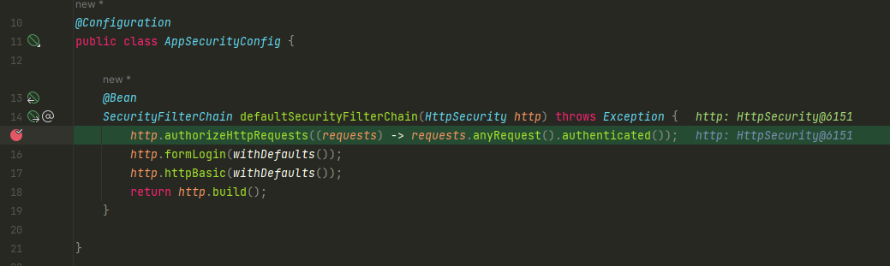

# Backend rest services
## Services without security
  - `/contact` - this service should accept the details from the contact us page in the UI and save to the DB
  - `/notices` - this service should send the notice details from the DB to the notices page in the UI
  
## Service with security
  - `/myAccount` - this service should send the account details of the logged in use from the DB to the UI
  - `/myBalance` - this service should send the balance of transaction details of the logged in user from the DB to the UI
  - `/myLoans` - this service should send the loan details of the logged in user from the DB to the UI
  - `/myCards` - this service should send the cards details of the logged in user from the DB to the UI

## Configuring security

### The default security filter chain

By default all paths are secured because of the defaultSecurityFilterChain in SpringBootWebSecurityConfiguration class 
This class is in  the org.springframework.boot:spring-boot-autoconfigure:3.1.4 dependency

     @Bean
     @Order(SecurityProperties.BASIC_AUTH_ORDER)
     SecurityFilterChain defaultSecurityFilterChain(HttpSecurity http) throws Exception {
         http.authorizeHttpRequests((requests) -> requests.anyRequest().authenticated());
     	 http.formLogin(withDefaults());
     	 http.httpBasic(withDefaults());
     	 return http.build();
     }

### Step 1a: Configuring the security filter chain
We can create a more custom security filter chain in a configuration class. 
1. Copy the method from SpringBootWebSecurityConfiguration
2. Create a AppSecurityConfig class annotated as configuration 
3. Add the same bean (without Order annotation)

    @Configuration
    public class AppSecurityConfig {
        @Bean
        SecurityFilterChain defaultSecurityFilterChain(HttpSecurity http) throws Exception {
            http.authorizeHttpRequests((requests) -> requests.anyRequest().authenticated());
            http.formLogin(withDefaults());
            http.httpBasic(withDefaults());
            return http.build();
        }
    
    }

In debut mode, the defaultSecurityFilter chain is called. 

### Step 1b: Customizing the security filter chain with secured and unsecured routes
We pass request matcher that are string patterns for routes requiring authentication and routes that are 
permitted to all users.

    @Bean
    SecurityFilterChain defaultSecurityFilterChain(HttpSecurity http) throws Exception {
        http.authorizeHttpRequests((requests) -> requests
                .requestMatchers("/myAccount", "/myBalance", "/myLoans", "/myCards").authenticated()
                .requestMatchers("/notices", "/contact").permitAll());
        http.formLogin(withDefaults());
        http.httpBasic(withDefaults());
        return http.build();
    }

the form login and httpBasic and build can be added to the first line: 

    @Bean
    SecurityFilterChain defaultSecurityFilterChain(HttpSecurity http) throws Exception {
        return http.authorizeHttpRequests((requests) -> requests
                .requestMatchers("/myAccount", "/myBalance", "/myLoans", "/myCards").authenticated()
                .requestMatchers("/notices", "/contact").permitAll())
                .formLogin(withDefaults())
                .httpBasic(withDefaults())
                .build();
    }

### Step 2: managing users
At this stage, only one user can access the application.

    spring.security.user.name=root
    spring.security.user.password=root

We can configure multiple users and store credentials in application memory or into database and give more flexibility. 

First approach allow to manage users using in memory storage: 
Two solutions for this approach : 

    @Bean
    InMemoryUserDetailsManager userDetailsService() {
        UserDetails admin = User.withDefaultPasswordEncoder()
                .username("admin")
               .password("12345")
               .authorities("admin")
               .build();
    
      UserDetails user = User.withDefaultPasswordEncoder()
             .username("user")
             .password("12345")
             .authorities("read")
             .build();
     return new InMemoryUserDetailsManager(admin, user);
    }

or: 

     @Bean
     InMemoryUserDetailsManager userDetailsService() {
         InMemoryUserDetailsManager inMemoryUserDetailsManager = new InMemoryUserDetailsManager();

         UserDetails admin = User.withUsername("admin")
                .password("12345")
                .authorities("admin")
                .build();

         UserDetails user = User.withUsername("user")
                 .password("12345")
                 .authorities("read")
                 .build();
         inMemoryUserDetailsManager.createUser(admin);
         inMemoryUserDetailsManager.createUser(user);
      return inMemoryUserDetailsManager;
     }

     @Bean
    PasswordEncoder passwordEncoder() {
         return NoOpPasswordEncoder.getInstance();
     }

Note: those 2 approaches should not be used for production, just for test purpose.
- UserDetails - service is the core interface which loads user specific data 
- UserDetailsManager - extends the UserDetailsService and allow user creation and update
- InMemoryUserDetailsManager is an implementation of the Managern as well as JdbcUserDetailsManager
  or LdapUsersDetailsManager

### Step 3: managing password with PasswordEncoder

Storing passwords with plain text in a storage like database may cause integrity and confidentiality issues. 
- DB can be accessed by DB Admins and could get credentials.
- Hackers could access to database too

3 options are available for password management
- encoding: 
  - defined as the process of converting data from one form to another and has nothing to do with cryptography
  - it envolves no secret and completely reversible
  - encoding can't be used for securing data
  - Some encodind algorithms: ASCII, base64, unicode
- encryption:
  - defined as the process of transforming data in such a way that guarantees confidentiality
  - to achieve confidentiality, encryption requires the use of a secret which in cryptographic terms is called a key
  - encryption can be reversible by using decryption with the help of the key. As long as the key is confidential, 
    encryption can be considered as secured
- hashing:
  - in hashing, data is converted to the hash value using hashing function
  - data once hashed is non-reversible. One cannot determine the original data from a hash value generated
  - given some arbitrary data along with the output, one can verify whether data matches the original input data without
    needing to see the original data

PasswordEncoder has 3 methods:
- endcode
- matches
- updagradeEncoding

Several password encoders implementations are available:
- **NoOpPasswordEndoder (not recommended)**
- **StandardPasswordEncoder (not recommended)**
- **Pbkdf2PasswordEncoder**: The algorithm is invoked on the concatenated bytes of the salt, secret and password (not really recommended).
  - a configurable random salt value length (default is 16 bytes)
  - a configurable number of iterations (default is 310000) 
  - a configurable key derivation function (see Pbkdf2PasswordEncoder.SecretKeyFactoryAlgorithm)
  - a configurable secret appended to the random salt (default is empty)
- **BCryptPasswordEncoder**:  Implementation of PasswordEncoder that uses the BCrypt strong hashing function. Clients 
    can optionally supply a "version" ($2a, $2b, $2y) and a "strength" (a.k.a. log rounds in BCrypt) and a SecureRandom 
    instance. The larger the strength parameter the more work will have to be done (exponentially) to hash the 
    passwords. The default value is 10.
- **SCryptPasswordEncoder**: Implementation of PasswordEncoder that uses the SCrypt hashing function. Clients can 
    optionally supply a cpu cost parameter, a memory cost parameter and a parallelization parameter. The currently 
    implementation uses Bouncy castle which does not exploit parallelism/optimizations that password crackers will, so 
    there is an unnecessary asymmetry between attacker and defender. Scrypt is based on Salsa20 which performs poorly in 
    Java (on par with AES) but performs awesome (~4-5x faster) on SIMD capable platforms.
- **Argon2PasswordEncoder**: Implementation of PasswordEncoder that uses the Argon2 hashing function. Clients can  
    optionally supply the length of the salt to use, the length of the generated hash, a cpu cost parameter, a memory 
    cost parameter and a parallelization parameter. Note: The currently implementation uses Bouncy castle which does 
    not exploit parallelism/optimizations that password crackers will, so there is an unnecessary  asymmetry between 
    attacker and defender.

BCryptPasswordEncoder is the most recommended encoder for passwords. Argon2 do consumes more memory.  

### Step 4: custom authentication logic 
 
We may want to implement a custom authentication provider. We can also have several authentication provider using 
password & login, using OAUth, using OTP also...

Interface AuthenticationProvider provides 2 abstract methods: 
- authenticate
- supports (boolean): we inform spring security that the authentication provider is supporter